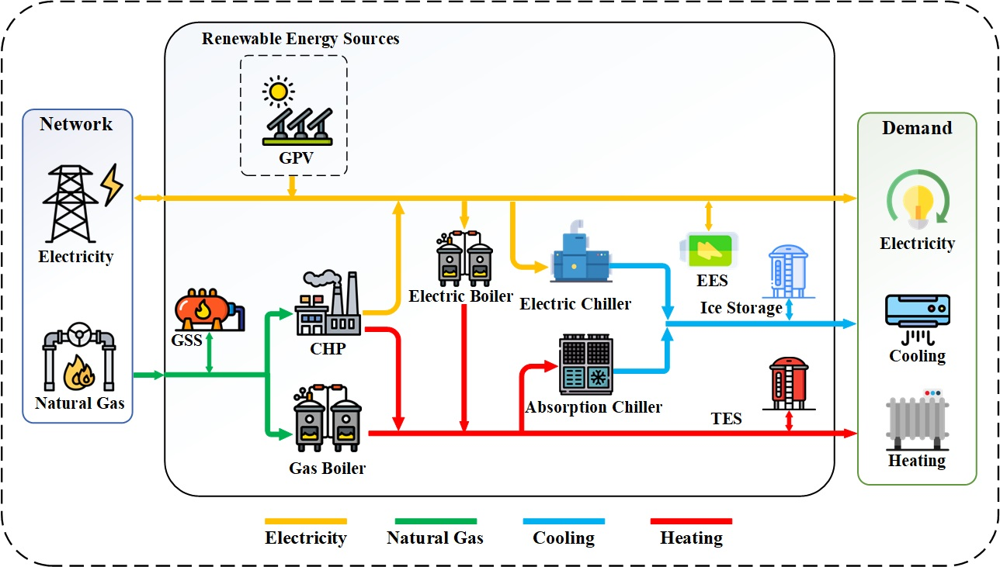

# Energy Hub Systems Optimization – Bachelor Thesis

This repository contains the code and presentation material for my **Bachelor Thesis** on **Energy Hub Systems**. The project focuses on the optimal operation and control of multi-carrier energy systems using **Model Predictive Control (MPC)**.

Energy hub systems integrate multiple energy carriers (electricity, heating, and cooling) to efficiently distribute energy, reduce operational losses, and minimize environmental impact. This project develops an optimization model to determine the **optimal production and distribution** of energy while considering the physical and operational constraints of system components. Renewable energy sources, such as photovoltaic (PV) systems, are included in the decision-making process.  

**Model Predictive Control (MPC)** enables the system to continuously update inputs and predict future behavior, allowing rapid and efficient responses to demand and generation fluctuations. Simulation results demonstrate reduced operational costs, improved renewable utilization, and maintained system stability, showing that MPC is an effective approach for managing real-world energy hub systems.

---

## Project Files

- **Code:** [MPC-Energy Hub.ipynb](MPC-Energy%20Hub.ipynb) – Python implementation of MPC for energy hub systems  
- **Presentation:** [MPC-Energy Hub PowerPoint.pdf](MPC-Energy%20Hub%20PowerPoint.pdf) – Presentation of project objectives, methodology, and results  
- **Figure:**  – Schematic diagram of the studied energy hub system  

---

## Keywords

Optimal control, Energy hub systems, Model Predictive Control (MPC), Energy optimization, Multi-energy resource management
